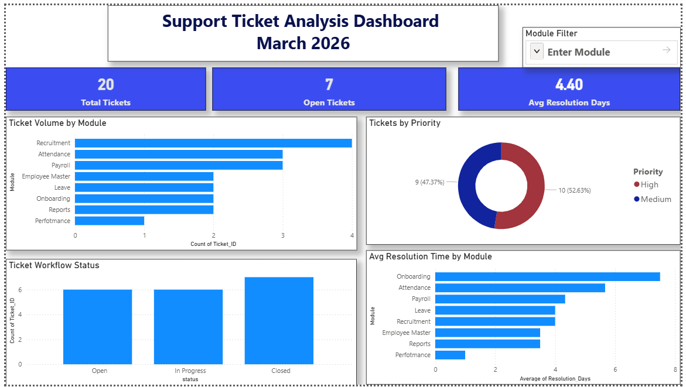

# 🎫 Support Ticket Analysis Dashboard

## 📌 Project Overview
This project analyzes support ticket data using **SQL, Excel, and Power BI** to uncover ticket trends, backlog risks, priority workloads, and operational performance.

The goal is to transform raw support ticket records into actionable insights that help teams:

- Improve response times  
- Reduce unresolved backlog  
- Monitor service efficiency  
- Identify high-volume problem areas  
- Support better business decisions  

This project demonstrates a complete analytics workflow from raw data to dashboard reporting.

---

## 🛠 Tools & Technologies Used

### Data Analysis
- SQL Server / SSMS
- CSV Files
- Data Cleaning

### Reporting & Visualization
- Excel
  - Pivot Tables
  - KPI Cards
  - Charts
  - Dashboard Design

- Power BI
  - Interactive Dashboards
  - KPI Metrics
  - Slicers / Filters
  - Business Visualizations

### Version Control
- GitHub

---

## 📂 Repository Structure

```text
Support-ticket-analysis/
├── dashboard/
│   ├── excel_dashboard.png
│   └── powerbi_dashboard.png

├── data/
│   └── tickets.csv

├── excel/
│   └── Support_Ticket_Project.xlsx

├── sql/
│   └── queries.sql

└── README.md
```

---

## 📊 Project Workflow

### 1️⃣ Data Collection
Created a structured support ticket dataset containing:

- Ticket ID  
- Ticket Date  
- Client  
- Module  
- Priority  
- Status  
- Assigned To  
- Resolution Days  

### 2️⃣ SQL Analysis
Imported data into SQL Server and performed:

- Data quality checks  
- NULL / blank validation  
- Duplicate checks  
- KPI calculations  
- Aggregation queries  
- Trend analysis  

### 3️⃣ Excel Dashboard
Built an executive dashboard using:

- Pivot Tables  
- KPI Cards  
- Module Analysis  
- Ticket Status Monitoring  
- Resolution Time Reporting  

### 4️⃣ Power BI Dashboard
Created an interactive dashboard with:

- Dynamic filtering  
- Slicers  
- KPI visuals  
- Operational insights  
- Performance comparisons  

### 5️⃣ GitHub Publishing
Organized all project files into a professional portfolio repository.

---

## 🎯 Business Questions Answered

- Which modules receive the highest number of tickets?
- How many tickets are Open, Closed, or In Progress?
- What is the average resolution time?
- Which priorities need urgent attention?
- Which departments generate more workload?
- Which modules take longer to resolve?
- Where are potential backlog risks?

---

## 📈 Key Insights

- Ticket demand is concentrated in selected business modules.
- Open tickets can be monitored through KPI cards.
- Resolution speed differs by module.
- Priority segmentation highlights urgent workloads.
- Dashboard reporting improves management visibility.
- Filtering tools allow faster decision-making.

---

## 🧠 SQL Skills Demonstrated

- SELECT Statements  
- WHERE Filtering  
- ORDER BY Sorting  
- GROUP BY Aggregations  
- HAVING Clause  
- CASE WHEN Logic  
- Subqueries  
- KPI Queries  
- Data Validation  

---

## 📊 Excel Skills Demonstrated

- Pivot Tables  
- Pivot Charts  
- Dashboard Layout Design  
- KPI Cards  
- Executive Reporting  
- Data Presentation  

---

## 📊 Power BI Skills Demonstrated

- Interactive Dashboard Design  
- KPI Cards  
- Donut / Bar / Column Charts  
- Slicers & Filters  
- Drilldown Reporting  
- Trend Analysis  
- Visual Storytelling  

---

## 🚀 Business Value

This dashboard can help support teams:

- Track daily operations  
- Reduce unresolved tickets  
- Improve SLA performance  
- Prioritize urgent cases  
- Monitor team efficiency  
- Identify recurring issues quickly  

---

## 💼 Roles This Project Supports

This project is relevant for:

- Data Analyst  
- Reporting Analyst  
- Business Analyst  
- Operations Analyst  
- Support Analyst  
- MIS Executive  

---

## 📷 Dashboard Preview

### Excel Dashboard


### Power BI Dashboard


---

## 🏁 Final Outcome

This project demonstrates an end-to-end analytics workflow:

**Raw Data → SQL Analysis → Excel Dashboard → Power BI Dashboard → GitHub Portfolio**

It reflects practical, job-ready skills in analytics, reporting, and business intelligence.


