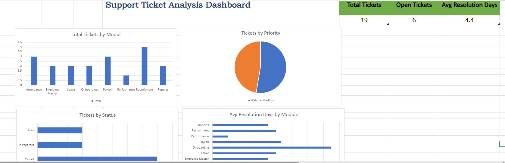

# Support Ticket Analysis Dashboard

## 📌 Project Overview
This project analyzes support ticket data using SQL, Excel, and dashboard reporting techniques to identify ticket trends, backlog risks, priority issues, and operational performance.

The objective is to transform raw support ticket records into actionable insights that help teams improve response times, reduce unresolved backlog, and monitor service efficiency.

---

## 🛠 Tools & Technologies Used
- SQL Server / SSMS
- Excel
  - Pivot Tables
  - KPI Cards
  - Charts
  - Dashboard Design
- CSV Data Handling
- GitHub

---

## 📂 Repository Structure
```text
Support-ticket-analysis/
├── dashboard/
│   └── excel_dashboard.png

├── data/
│   └── tickets.csv

├── excel/
│   └── Support_Ticket_Project.xlsx

├── sql/
│   └── queries.sql

└── README.md
```

---

## 📊 Data Workflow
1. Created and structured raw support ticket dataset  
2. Imported data into SQL Server for querying  
3. Performed data quality checks:
   - NULL values
   - Blank values
   - Duplicate records
4. Built KPI and trend queries using SQL  
5. Created Pivot Table analysis in Excel  
6. Designed executive dashboard with KPI cards and charts  
7. Published full project to GitHub

---

## 🎯 Business Questions Solved
- Which modules receive the highest ticket volume?
- How many tickets are currently open, closed, or in progress?
- What is the average resolution time?
- Which priorities need urgent attention?
- Which modules have slower ticket resolution?
- Where are potential backlog risks?

---

## 📈 Key Insights
- Ticket demand is concentrated in selected business modules.
- Open ticket volume can be monitored through dashboard KPIs.
- Resolution performance differs across modules.
- Priority segmentation helps identify urgent workloads.
- Dashboard reporting improves visibility for operational decisions.

---

## 🧠 SQL Skills Demonstrated
- SELECT statements
- Filtering with WHERE
- GROUP BY aggregations
- ORDER BY sorting
- CASE WHEN logic
- Subqueries
- HAVING clause
- KPI summary queries
- Data quality validation

---

## 📊 Excel Skills Demonstrated
- Pivot Tables
- Pivot Charts
- KPI Metrics
- Dashboard Layout Design
- Data Presentation
- Executive Reporting

---

## 🚀 Outcome
This project demonstrates an end-to-end analytics workflow: raw data preparation, SQL analysis, Excel dashboarding, and business storytelling.

It reflects practical skills relevant to:
- Data Analyst
- Reporting Analyst
- Business Analyst
- Operations Analyst
- Support Analyst

---

## 📷 Dashboard Preview

